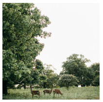
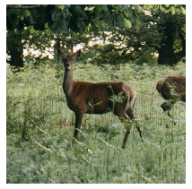

# Image Display Control Web Component

An easy way to do [Image Display Control](https://frameright.io) in your HTML
page. Made with :heart: by [Frameright](https://frameright.io). Power to the
pictures!

## Table of Contents

<!-- toc -->

- [Without this web component](#without-this-web-component)
- [Basic usage](#basic-usage)
- [Dependency tree / credits](#dependency-tree--credits)

<!-- tocstop -->

## Without this web component

When an image is too big for its `` HTML element, the best option browsers
offer nowadays is to use the
[`object-fit: cover;`](https://developer.mozilla.org/en-US/docs/Web/CSS/object-fit)
CSS property in order to scale and middle-crop it:

<table style="border: none;"><tr style="border: none;">
<td style="border: none;"><pre>
&lt;img
  src="https://images.pexels.com/photos/3625715/pexels-photo-3625715.jpeg"
  width="200"
  height="200"
  style="object-fit: cover;"
/&gt;
</pre></td>
<td style="border: none;"></td>
</tr></table>

This is less than optimal, as there might be, in the example above, a better
square-ish region in the image that could be displayed instead of the
middle-crop.

## Basic usage

This web component extends the `` tag with the ability to accept a list of
image regions, and to zoom in on the best one for the current element size:

<table style="border: none;"><tr style="border: none;">
<td style="border: none;"><pre>
&lt;img
  is="image-display-control"
  src="https://images.pexels.com/photos/3625715/pexels-photo-3625715.jpeg"
  width="200"
  height="200"
  data-image-regions='[{
    "id": "oneanimal",
    "names": ["One animal"],
    "shape": "rectangle",
    "unit": "relative",
    "x": "0.217",
    "y": "0.708",
    "width": "0.239",
    "height": "0.1467"
  }, {
    "id": "threeanimals",
    "names": ["Three animals"],
    "shape": "rectangle",
    "unit": "relative",
    "x": "0.245",
    "y": "0.725",
    "width": "0.419",
    "height": "0.121"
  }]'
/&gt;
</pre></td>
<td style="border: none;"></td>
</tr></table>

The resulting HTML element is
[responsive](https://developer.mozilla.org/en-US/docs/Learn/CSS/CSS_layout/Responsive_Design)
and will automatically reassess the best region to zoom in on when it gets
resized, e.g. when the user turns their phone from portrait to landscape.

&emsp; :airplane: [Usage](image-display-control/)

## Dependency tree / credits

- [ungap/custom-elements](https://github.com/ungap/custom-elements), a polyfill
  for web components on Safari. Many thanks to
  [WebReflection](https://github.com/WebReflection)!
