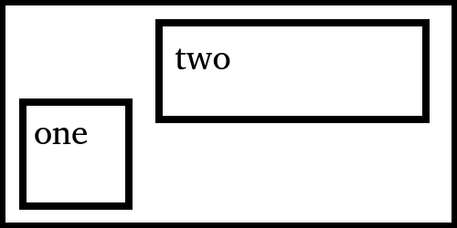

# Advanced usage

&emsp; :bulb: [GitHub Discussions](https://github.com/Frameright/image-display-control-web-component/discussions)

## Table of Contents

<!-- toc -->

- [HTML attributes](#html-attributes)
- [CSS styling](#css-styling)
- [HTML and CSS sizing](#html-and-css-sizing)
- [Building and importing](#building-and-importing)

<!-- tocstop -->

A comprehensive demo is available at [`../demo/`](../demo/), covering various
aspects of the web component. A typical example could look like this:

```html
<html>
  <head>
    <style>
      div {
        width: 400px;
        height: 200px;

        /* Make it resizable: */
        resize: both;
        overflow: hidden; /* needed in order the get a bottom-right resize handle */
      }

      img {
        border: 5px dashed red;

        /* Follow the parent resizable div: */
        box-sizing: border-box;
        width: 100%;
        height: 100%;
      }
    </style>
  </head>
  <body>
    <div>
      
    </div>

    <!-- Built with Webpack or Rollup. Contains the web component: -->
    <script src="mybundle.js"></script>
  </body>
</html>
```

This example creates an [Image Display Control](https://frameright.io) web
component automatically zooming in on one of the two regions of a hypothetical
image of cats:



It touches on the following aspects.

## HTML attributes

* All the attributes of the usual
  [``](https://developer.mozilla.org/en-US/docs/Web/HTML/Element/img)
  element are supported, e.g. `src=`, `srcset=`, `sizes=`, `width=`, etc.
* The `is=` attribute is what makes the web component's implementation kick in.
* Information specific to the web component is passed via `data-*=` attributes.
* Image regions can be specified with relative or pixel coordinates.
* The web component plays nicely with
  [pixel-density-specific image candidates](https://developer.mozilla.org/en-US/docs/Web/API/HTMLImageElement/srcset)
  described with `srcset=` and `sizes=`. Our hypothetical image has three
  candidates: `cats-1024x512.jpg`, `cats-768x384.jpg` and `cats.jpg`, which
  should be at least `2000px` wide.

See [HTML attributes](explanation/attributes.md) for more details.

## CSS styling

The usual ways of styling an `` element are supported, e.g. `width:`,
`border:`, `padding:`, etc.

See [CSS styling](explanation/styling.md) for more details.

## HTML and CSS sizing

* The usual ways of sizing an `` element are supported, e.g. HTML `width=`,
  CSS `height:`, etc.
* The web component is 
  [responsive](https://developer.mozilla.org/en-US/docs/Learn/CSS/CSS_layout/Responsive_Design)
  and will automatically reassess the best region to zoom in on when it gets
  resized, e.g. when the user turns their phone from portrait to landscape.
* The web component takes exactly the same space as a standard `` element
  would under the same circumstances and styling.

## Building and importing

The web component would typically be bundled inside your web app project, using
e.g. [Webpack](https://webpack.js.org/) or [Rollup](https://rollupjs.org/).

See [Importing in your project](explanation/importing.md) for more details.
